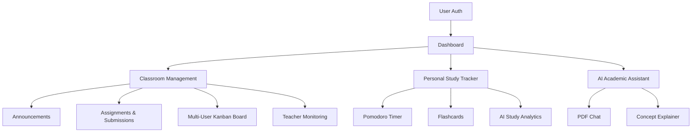
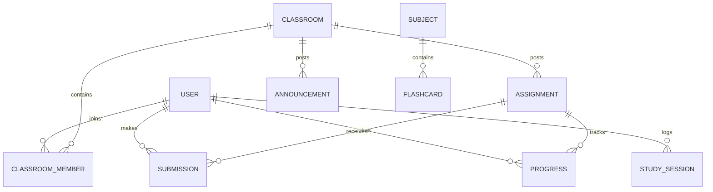

# Smart Study Tracker with Classroom Collaboration System

A mission-critical academic operating system that integrates classroom management, assignment tracking, AI-powered study analytics, and a multi-user Kanban collaboration system into a unified premium platform.

---

## 📖 Table of Contents
* [Project Overview](#-project-overview)
* [Key Features](#-key-features)
* [Workflow Diagram](#-workflow-diagram)
* [Tech Stack & Technologies](#-tech-stack--technologies)
* [Database Design & ER Diagram](#-database-design--er-diagram)
* [API Endpoints](#-api-endpoints)
* [AI Intelligent Layer](#-ai-intelligent-layer)
* [Installation Guide](#-installation-guide)
* [Environment Variables](#-environment-variables)
* [Folder Structure](#-folder-structure)
* [Usage Guide](#-usage-guide)
* [Security & Performance](#-security--performance)
* [Future Improvements](#-future-improvements)
* [License](#-license)

---

## 🌟 Project Overview
The **Smart Study Tracker** bridges the gap between classroom administration and personal study habits. It provides a high-performance environment where students manage academic responsibilities and track learning progress through advanced AI insights.

**Core Objectives:**
- **Classroom Collaboration:** Secure classroom environments with unique join codes.
- **Kanban Assignments:** Personal and collaborative assignment management.
- **AI Analytics:** Data-driven weakness detection and study optimization.
- **Academic Assistant:** 24/7 AI Tutor with PDF context support.

---

## 🚀 Key Features

### 🎓 Classroom & Collaboration
- **Multi-User Kanban System:** Revolutionary Trello-style workflow where students track individual progress (To-Do, In-Progress, Done) independently.
- **Teacher Monitoring Hub:** Owners can view a "People" dashboard showing aggregated progress (Todo, Doing, Done) and detailed read-only views of any student's individual Kanban board.
- **Announcement Portal:** Real-time information sharing and file attachments within classrooms.
- **Assignment System:** Teachers post tasks with deadlines; students upload PDF submissions with status tracking.
- **Grade Visibility:** Students see their specific marks and teacher feedback directly on the assignment card, with **conditional performance coloring** (Red for <40%, Amber for <75%, Green for ≥75%).
- **Grade Summary Dashboard:** An automated calculated grade summary in the sidebar using weighted progress and performance-based UI indicators.
- **Classroom Joining:** Secure enrollment using unique 6-character class codes.

### 📊 AI-Powered Analytics
- **Weakness Detection Engine:** AI identifies tough topics based on session data and flashcard performance.
- **Study Rhythm Optimization:** Recommends peak performance windows (e.g., "Your focus peaks at 10:00 AM") based on history.
- **Assignment Risk Predictor:** Tags tasks as Low/Med/High risk using complexity and time-to-deadline analysis.
- **Consistency Heatmap:** GitHub-style visualization of academic commitment over time.
- **Skeletal Loading UI:** Professional animated placeholders during data processing.

### ⏱️ Productivity Tools
- **Gamified Pomodoro:** Customizable focus/break durations with visual progress tracking and distraction logging.
- **Flashcard System:** Integrated active recall modules with "Direct Recall" high-density grid views.
- **AI Flashcard Generator:** Instant flashcards created from subject topics via AI curriculum analysis.
- **Study Tracker:** Granular logging of duration, focus score, and specific topics studied.

### 🤖 AI Tutor 2.0
- **PDF Context Support:** Upload any academic PDF and chat with the AI about its contents with a 5MB context window.
- **Domain Restricted:** Locked to academic queries to ensure professional guidance.
- **Context-Aware Memory:** Maintains conversational flow for complex multi-part explanations.
- **Fallback Reliability:** Dual-model system (DeepSeek Qwen/Llama) ensures 100% uptime.

---

## 🔄 Workflow Diagram



---

## 💻 Tech Stack & Technologies

### Frontend
- **React 18 & Vite:** High-speed SPA framework.
- **Tailwind CSS:** Modern utility-first styling with Glassmorphism.
- **Lucide React:** Premium iconography.
- **Recharts:** Interactive data visualisations for heatmaps and charts.
- **React Router Dom 7:** Advanced client-side routing.
- **React Markdown:** Renders AI responses with code highlighting.

### Backend
- **Node.js & Express:** Enterprise-grade server environment.
- **Mongoose:** Object Data Modeling (ODM) for MongoDB.
- **JWT & BcryptJS:** Secure authentication and password hashing.
- **Multer & Cloudinary:** Large file handling and cloud storage with centralized stream-based uploads.
- **PDF-Parse 1.1.1:** Stable text extraction for AI context processing.

### AI Service
- **Python 3.10+ & FastAPI:** High-performance microservice for AI orchestration.
- **Hugging Face Hub:** Connects to DeepSeek-R1-Distill-Qwen/Llama models.
- **Requests & Dotenv:** Service-level configuration and external API calls.

---

## 🗄️ Database Design & ER Diagram



### Major Collections:
- **Users:** Roles (Teacher/Student), Profile Info, Hashed Credentials.
- **Classrooms:** Class Code, Metadata, Member Lists.
- **Progress:** Individual assignment status (`todo`, `doing`, `done`) per student.
- **Assignments:** Max Marks, Deadlines, PDF Attachments.
- **StudySessions:** Focus scores, durations, and timestamped topic logs.

---

## 📡 API Endpoints

### 🔑 Authentication (`/api/auth`)
- `POST /register` - User signup with role selection.
- `POST /login` - Secure entry with JWT generation.

### 🏫 Classroom & Collaboration (`/api/class`)
- `POST /create` - Teacher-only class initialization.
- `POST /join` - Student enrollment via code.
- `POST /announcement` - Broadcast message with class context.
- `GET /:id/members` - Retrieve all enrolled students (Teacher view).
- `POST /progress/update` - Update student-specific Kanban status.

### 📝 Assignments (`/api/assignment`)
- `POST /create` - Teachers upload tasks.
- `GET /class/:classId` - List assignments with deadlines.
- `POST /:id/submit` - Student assignment submission (Supports PDF, Images, Word).
- `POST /submission/:submissionId/grade` - Teacher endpoint to grade and provide feedback.

### 📈 Analytics & AI (`/api/study` & `/api/chat`)
- `GET /analytics/dashboard` - Real-time statistics for charts.
- `POST /api/ai/extract-pdf` - Extract text from uploaded PDF for AI context.
- `POST /chat` - AI interaction with parsed PDF context and history.

---

## 🛠️ Installation Guide

1. **Clone the Project:**
   ```bash
   git clone <repository-url>
   cd "Smart Study Tracker"
   ```

2. **Server Installation (Backend):**
   ```bash
   cd backend
   npm install
   npm run dev  # Starts on Port 5000
   ```

3. **AI Service Installation (Python):**
   ```bash
   cd ai-service
   pip install -r requirements.txt
   uvicorn main:app --reload  # Starts on Port 8000
   ```

4. **Client Installation (Frontend):**
   ```bash
   cd frontend
   npm install
   npm run dev  # Starts on Port 5173
   ```

---

## 🔑 Environment Variables

### Backend (`/backend/.env`)
```env
PORT=5000
MONGO_URI=mongodb_uri
JWT_SECRET=secure_secret
CLOUDINARY_CLOUD_NAME=your_name
CLOUDINARY_API_KEY=your_key
CLOUDINARY_API_SECRET=your_secret
```

### AI Service (`/ai-service/.env`)
```env
HF_API_TOKEN=hugging_face_token
```

---

## � Folder Structure

- **/backend:** Express server controllers, routes, Mongoose models, and centralized **utils**.
- **/frontend:** React components, context providers, Recharts dashboards, and Tailwind styles.
- **/ai-service:** Python FastAPI logic for LLM processing and subject analysis.
- **/uploads:** Temporary local buffer for file processing (minimal usage).

---

## 🛡️ Security & Performance
- **Role Isolation:** Strict middleware ensures students cannot access teacher monitoring boards.
- **Data Optimization:** MongoDB indexing on `userId` for O(1) analytics retrieval.
- **Reliability:** 1-hour study threshold for AI models to ensure grounded, data-driven insights.
- **Unified Storage:** Centralized Cloudinary helper allowing secure uploads for **all academic file types** (Images, PDFs, Docs) up to 50MB.

---

## 🔮 Future Improvements
- **Live Classroom Chat:** WebSocket integration for instant messaging.
- **AI Peer Matching:** Connect students with similar study rhythms.
- **Parental Dashboard:** View-only access for academic progress monitoring.

---

## 📄 License
This project is licensed under the academic **Education First License** for development and research.
