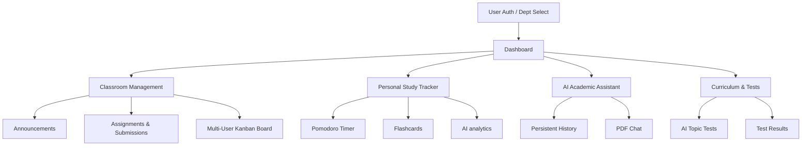
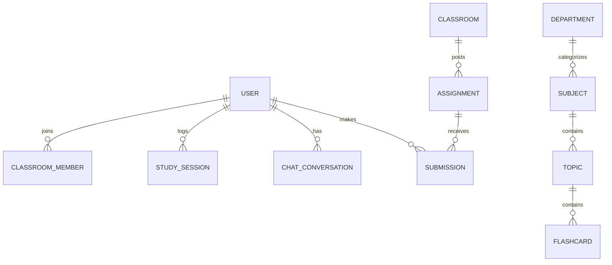

# Smart Study Tracker with Classroom Collaboration System

A mission-critical academic operating system that integrates classroom management, assignment tracking, AI-powered study analytics, a global curriculum system, and dynamic AI-generated testing into a unified premium platform.

---

## 📖 Table of Contents
* [Project Overview](#-project-overview)
* [Key Features](#-key-features)
* [Workflow Diagram](#-workflow-diagram)
* [Tech Stack & Technologies](#-tech-stack--technologies)
* [Database Design & ER Diagram](#-database-design--er-diagram)
* [API Endpoints](#-api-endpoints)
* [AI Intelligent Layer](#-ai-intelligent-layer)
* [Installation Guide](#-installation-guide)
* [Environment Variables](#-environment-variables)
* [Folder Structure](#-folder-structure)
* [Usage Guide](#-usage-guide)
* [Security & Performance](#-security--performance)
* [Future Improvements](#-future-improvements)
* [License](#-license)

---

## 🌟 Project Overview
The **Smart Study Tracker** bridges the gap between classroom administration and personal study habits. It provides a high-performance environment where students manage academic responsibilities and track learning progress through advanced AI insights and a standardized curriculum system.

**Core Objectives:**
- **Global Curriculum System:** Standardized subjects, topics, and subtopics sorted by Department and Semester.
- **Classroom Collaboration:** Secure classroom environments with unique join codes.
- **AI-Generated Testing:** Dynamic test generation based on curriculum topics with instant results.
- **AI Analytics:** Data-driven weakness detection and study optimization.
- **Academic Assistant:** 24/7 AI Tutor with persistent chat history and PDF context support.

---

## 🚀 Key Features

### 🎓 Global Curriculum & Department Management
- **Centralized Curriculum:** Subjects are managed globally by admins, featuring Course Codes, Departments (CO, IF, IT, etc.), and Semesters (1-6).
- **Auto-Filtering:** Students automatically see subjects relevant to their registered Department and Semester.
- **Admin Dashboard:** Powerful interface for creating departments and bulk-importing curriculum data via JSON.

### 🎓 Classroom & Collaboration
- **Multi-User Kanban System:** Revolutionary Trello-style workflow where students track individual progress (To-Do, In-Progress, Done) independently.
- **Teacher Monitoring Hub:** Owners can view a "People" dashboard showing aggregated progress and detailed read-only views of any student's individual Kanban board.
- **Announcement Portal:** Real-time information sharing and file attachments within classrooms.
- **Assignment System:** Teachers post tasks with deadlines; students upload PDF submissions with status tracking.
- **Grade Summary Dashboard:** Automated calculated grade summary in the sidebar using weighted progress and performance-based UI indicators.

### 📊 AI-Powered Analytics & Testing
- **AI Test Engine:** Generates multiple-choice or descriptive questions instantly based on specific curriculum topics.
- **Detailed Test Results:** Interactive results page breaking down performance and identifying specific knowledge gaps.
- **Weakness Detection:** AI identifies tough topics based on session data, test results, and flashcard performance.
- **Consistency Heatmap:** GitHub-style visualization of academic commitment over time.

### 🤖 AI Tutor 2.0 (Persistent)
- **Persistent Chat History:** Seamlessly resume past conversations with a dedicated history sidebar.
- **Conversation Management:** Create, rename, and delete chat threads for organized learning.
- **PDF Context Support:** Upload academic PDFs to chat specifically about their contents.
- **Domain Restricted:** Locked to academic queries to ensure professional guidance.

### ⏱️ Productivity Tools
- **Gamified Pomodoro:** Customizable focus/break durations with visual progress tracking.
- **Flashcard System:** Integrated active recall modules with AI-powered generator using the global curriculum.
- **Study Tracker:** Granular logging of duration, focus score, and specific topics studied.

---

## 🔄 Workflow Diagram



---

## 💻 Tech Stack & Technologies

### Frontend
- **React 18 & Vite:** High-speed SPA framework.
- **Tailwind CSS:** Modern utility-first styling with Glassmorphism.
- **Lucide React:** Premium iconography.
- **Recharts:** Interactive data visualisations.
- **React Markdown:** Renders AI responses with high-fidelity code highlighting.

### Backend
- **Node.js & Express:** Enterprise-grade server environment.
- **Mongoose:** Object Data Modeling (ODM) for MongoDB.
- **JWT & BcryptJS:** Secure authentication.
- **Multer & Cloudinary:** Centralized cloud storage for assignments and PDFs.

### AI Service
- **Python 3.10+ & FastAPI:** High-performance microservice for AI orchestration.
- **Hugging Face Hub:** Connects to DeepSeek-R1-Distill-Qwen/Llama models.

---

## 🗄️ Database Design & ER Diagram



### Major Collections:
- **Users:** Records identity, department, semester, and credentials.
- **Departments:** Dynamic storage of department codes and available semesters.
- **Subjects:** Global curriculum data with course codes and nested topics/subtopics.
- **ChatConversations:** Persistent AI interaction history per user.
- **Classrooms:** Class codes, metadata, and member management.

---

## 📡 API Endpoints

### 🔑 Authentication (`/api/auth`)
- `POST /register` - Includes department and semester selection.
- `PATCH /profile` - Update registered department/semester.

### 🏫 Curriculum (`/api/admin/subject` & `/departments`)
- `GET /departments` - Public route to fetch available departments.
- `GET /subject` - Auto-filters subjects by student's dept/semester.
- `POST /bulk-import` - (Admin) Import curriculum JSON data.

### 🤖 Chat (`/chat`)
- `GET /` - Fetch all conversation titles for sidebar.
- `POST /create` - Start a new persistent conversation.
- `POST /message` - Add message to history and get AI response.

---

## 🛠️ Installation & Seeding

1. **Backend Setup:**
   ```bash
   cd backend
   npm install
   # Seed the curriculum data
   node data/seed.js
   npm run dev
   ```

2. **AI Service:**
   ```bash
   cd ai-service
   pip install -r requirements.txt
   uvicorn main:app --reload
   ```

3. **Frontend:**
   ```bash
   cd frontend
   npm install
   npm run dev
   ```

---

## 🛡️ Security & Performance
- **Role Isolation:** Private routes prevent unauthorized access to Admin/Teacher zones.
- **Database Seeding:** Automated script imports standardized Computer Engineering curriculum (Sem 5 & 6) instantly.
- **Field Normalization:** Switched from ad-hoc naming to structured `subjectName`, `topicName`, and `courseCode` across the entire stack.

---

## 📄 License
This project is licensed under the academic **Education First License** for development and research.
