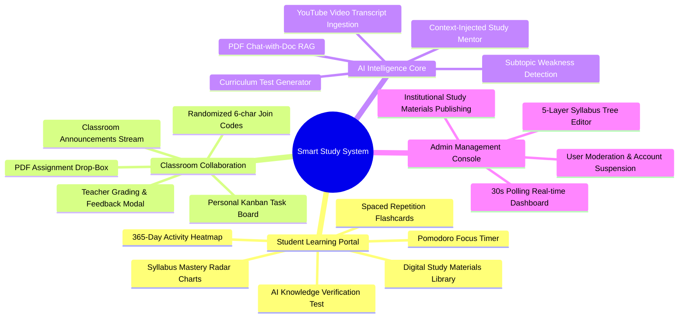
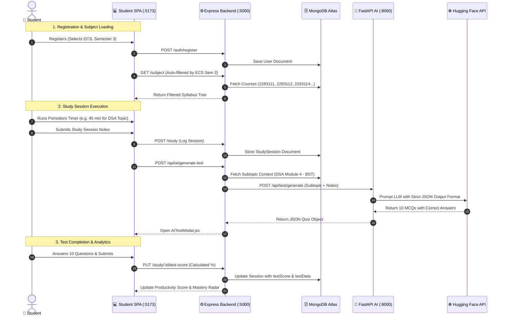
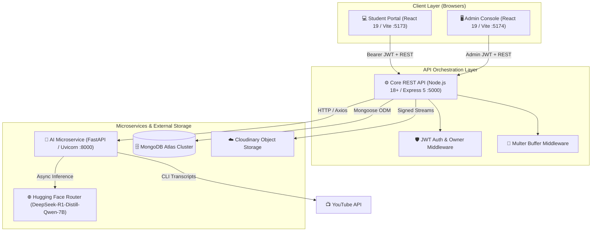
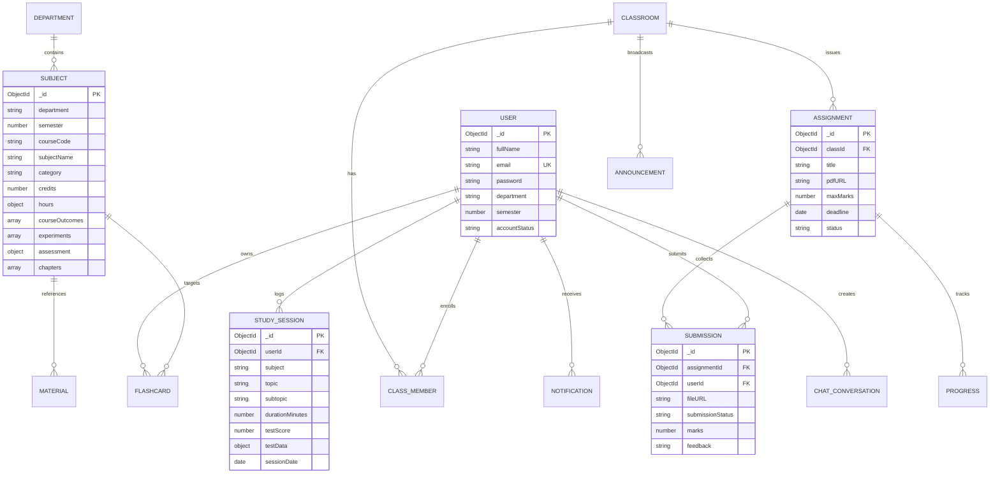
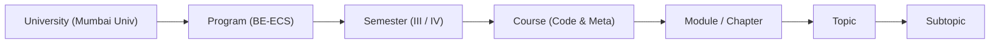

# Smart Study Tracker & Classroom Collaboration System

> **An enterprise-grade, microservice-driven academic operating system engineered for structured curriculum navigation, real-time study tracking, intelligent AI mentoring, automated verification testing, and institutional classroom collaboration.**

---

## 📑 Table of Contents

- [1. Project Overview](#1-project-overview)
  - [1.1 Introduction](#11-introduction)
  - [1.2 Problem Statement](#12-problem-statement)
  - [1.3 Proposed Solution](#13-proposed-solution)
  - [1.4 Project Vision](#14-project-vision)
  - [1.5 Project Goals](#15-project-goals)
- [2. Project Objectives](#2-project-objectives)
- [3. System Scope](#3-system-scope)
  - [3.1 In Scope](#31-in-scope)
  - [3.2 Out of Scope](#32-out-of-scope)
- [4. Key Features](#4-key-features)
  - [4.1 User Authentication & Role Management](#41-user-authentication--role-management)
  - [4.2 5-Layer Syllabus & Curriculum Engine](#42-5-layer-syllabus--curriculum-engine)
  - [4.3 Focus Timer & Study Session Logging](#43-focus-timer--study-session-logging)
  - [4.4 Automated Post-Study AI Verification Testing](#44-automated-post-study-ai-verification-testing)
  - [4.5 Spaced Repetition Active Recall Flashcards](#45-spaced-repetition-active-recall-flashcards)
  - [4.6 Classroom Collaboration, Streams & Kanban Tasks](#46-classroom-collaboration-streams--kanban-tasks)
  - [4.7 Assignment Drop-Box & In-App PDF Preview Proxy](#47-assignment-drop-box--in-app-pdf-preview-proxy)
  - [4.8 RAG-Powered AI Study Assistant & Chatbot](#48-rag-powered-ai-study-assistant--chatbot)
  - [4.9 Academic Analytics & Burnout Risk Engine](#49-academic-analytics--burnout-risk-engine)
  - [4.10 Admin Management Console](#410-admin-management-console)
- [5. User Roles & Access Control](#5-user-roles--access-control)
- [6. System Workflow](#6-system-workflow)
- [7. Application Architecture](#7-application-architecture)
  - [7.1 High-Level Architecture](#71-high-level-architecture)
  - [7.2 Microservice Breakdown](#72-microservice-breakdown)
- [8. Technology Stack](#8-technology-stack)
- [9. Project Directory Structure](#9-project-directory-structure)
- [10. Database Architecture & Data Models](#10-database-architecture--data-models)
  - [10.1 Entity Relationship Diagram (ERD)](#101-entity-relationship-diagram-erd)
  - [10.2 Mongoose Schema Definitions](#102-mongoose-schema-definitions)
- [11. Syllabus Data Architecture (NEP 2020 B.E. ECS)](#11-syllabus-data-architecture-nep-2020-be-ecs)
  - [11.1 Academic Hierarchy](#111-academic-hierarchy)
  - [11.2 Master Course Catalogue (Semesters III & IV)](#112-master-course-catalogue-semesters-iii--iv)
  - [11.3 Schema Representation Example](#113-schema-representation-example)
- [12. Backend API Documentation](#12-backend-api-documentation)
  - [12.1 Authentication Endpoints](#121-authentication-endpoints)
  - [12.2 Classroom & Member Endpoints](#122-classroom--member-endpoints)
  - [12.3 Assignment & Submission Endpoints](#123-assignment--submission-endpoints)
  - [12.4 Study Session & Tracker Endpoints](#124-study-session--tracker-endpoints)
  - [12.5 Analytics & Intelligence Endpoints](#125-analytics--intelligence-endpoints)
  - [12.6 Flashcard Endpoints](#126-flashcard-endpoints)
  - [12.7 AI Core & Chat Endpoints](#127-ai-core--chat-endpoints)
  - [12.8 Subject & Curriculum Endpoints](#128-subject--curriculum-endpoints)
  - [12.9 Admin Console Endpoints](#129-admin-console-endpoints)
- [13. Authentication & Security Architecture](#13-authentication--security-architecture)
- [14. Study Tracking & Verification Pipeline](#14-study-tracking--verification-pipeline)
- [15. Analytics, Consistency & Burnout Detection](#15-analytics-consistency--burnout-detection)
- [16. AI Microservice & Inference Engine](#16-ai-microservice--inference-engine)
- [17. Frontend Documentation](#17-frontend-documentation)
  - [17.1 Student Web Portal (`frontend/`)](#171-student-web-portal-frontend)
  - [17.2 Admin Management Console (`admin-frontend/`)](#172-admin-management-console-admin-frontend)
- [18. Installation & Setup Guide](#18-installation--setup-guide)
- [19. Environment Variables Configuration](#19-environment-variables-configuration)
- [20. Running the Application](#20-running-the-application)
- [21. Development Workflow & Seeding](#21-development-workflow--seeding)
- [22. Testing Strategy](#22-testing-strategy)
- [23. Error Handling & Resilience](#23-error-handling--resilience)
- [24. Security Practices](#24-security-practices)
- [25. Performance Considerations](#25-performance-considerations)
- [26. Deployment Architecture](#26-deployment-architecture)
- [27. Screenshots & UI Walkthrough](#27-screenshots--ui-walkthrough)
- [28. Example End-to-End User Journey](#28-example-end-to-end-user-journey)
- [29. Project Implementation Status](#29-project-implementation-status)
- [30. Known Limitations](#30-known-limitations)
- [31. Future Enhancements & Roadmap](#31-future-enhancements--roadmap)
- [32. Contribution Guidelines](#32-contribution-guidelines)
- [33. License](#33-license)
- [34. Author](#34-author)
- [35. Acknowledgements & References](#35-acknowledgements--references)

---

# 1. Project Overview

## 1.1 Introduction
The **Smart Study Tracker & Classroom Collaboration System** is an enterprise-grade academic platform engineered to bridge solitary study tracking, institutional classroom workflows, and contextual artificial intelligence.

Unlike generic study timers or fragmented note-taking apps, the system anchors all learning sessions, test generation, flashcards, and student performance metrics to a unified, hierarchical **5-layer curriculum structure** (*Department → Subject → Chapter → Topic → Subtopic*). Designed around the **University of Mumbai NEP 2020 B.E. Electronics and Computer Science (`BE-ECS`)** syllabus, the platform ensures that AI interactions and progress tracking reflect verifiable course requirements.

## 1.2 Problem Statement
Modern higher education workflows suffer from severe fragmentation:
1. **Disconnected Tooling:** Students juggle disjointed applications for Pomodoro timing, active recall flashcards, PDF reading, assignment management, and institutional communications.
2. **Lack of Performance Analytics:** Traditional LMS platforms collect submission data for instructors but fail to provide students with actionable analytics on time allocation, peak focus hours, subject mastery, or academic fatigue.
3. **Generic AI Hallucinations:** Commercial AI assistants lack awareness of university curricula, semester constraints, personal study history, and past assessment scores.
4. **Zero Teacher Diagnostic Visibility:** Educators lack real-time visibility into which syllabus subtopics are causing friction before semester examinations.

## 1.3 Proposed Solution
The platform integrates academic operations into a single cohesive microservice ecosystem:
* **Curriculum Hierarchy:** All study activities map directly to an accredited syllabus database.
* **Objective Verification:** Study sessions conclude with an automated AI-generated 10-question MCQ test mapped directly to the notes and subtopic studied.
* **Spaced Repetition Flashcards:** Dynamic generation of digital flashcards utilizing spaced repetition intervals based on student difficulty ratings.
* **Classroom Engine:** Randomized access codes, classroom streams, assignment submissions with Cloudinary storage, automated deadline risk analysis, and personal Kanban task boards.
* **Context-Injected Mentorship:** The AI assistant receives a dynamically constructed 6-month academic profile (syllabus map, recent test scores, assignment grades, and uploaded notes) before responding.

## 1.4 Project Vision
To establish an open-source, modular academic operating system that transforms syllabus tracking into active, data-driven mastery for universities, educators, and independent engineering students.

## 1.5 Project Goals
* Digitize complex university engineering syllabi into queryable hierarchical JSON models.
* Replace subjective self-ratings with verifiable post-study testing metrics.
* Provide early-warning indicators for impending assignment deadlines and academic burnout.
* Deliver an intuitive user experience across dedicated student and administrative Single Page Applications (SPAs).

---

# 2. Project Objectives

1. **Structured Data Modeling:** Represent the entire University of Mumbai NEP 2020 B.E. Electronics and Computer Science syllabus (Semesters III & IV) as normalized, indexable entities.
2. **Context-Aware LLM Inference:** Interface with high-throughput open-weight models (DeepSeek-R1-Distill-Qwen-7B / Llama-8B via Hugging Face Inference) to extract PDF textbooks, summarize YouTube video transcripts, and generate syllabus-bounded assessments.
3. **Multi-Role Security:** Implement isolated JWT authentication perimeters separating student accounts from administrative oversight consoles.
4. **Real-Time Data Visualization:** Render SVG consistency heatmaps, radar mastery plots, and time-optimization distributions using Recharts.

---

# 3. System Scope

## 3.1 In Scope
* Dedicated Student Portal (`frontend/`) and Administrative Management Console (`admin-frontend/`).
* Centralized Node.js/Express REST API backend (`backend/`) interfacing with MongoDB Atlas.
* Asynchronous Python/FastAPI microservice (`ai-service/`) for Natural Language Processing and Hugging Face inference.
* Full Semester III (11 courses, 22 credits) & Semester IV (12 courses, 23 credits) B.E. ECS course structures.
* Spaced repetition flashcard generation, Pomodoro study logger, and interactive quiz modal.
* Virtual classroom creation, join codes, assignment management, submissions, and PDF streaming proxy.

## 3.2 Out of Scope
* Live video streaming / WebRTC conferencing (scheduled for future releases).
* Mobile-native iOS / Android binary packages (web responsive architecture currently implemented).
* Automated payment processing or institutional tuition fee collection.

---

# 4. Key Features


```mermaid
mindmap
  root((Smart Study System))
    Student Learning Portal
      Pomodoro Focus Timer
      AI Knowledge Verification Test
      Spaced Repetition Flashcards
      365-Day Activity Heatmap
      Syllabus Mastery Radar Charts
      Digital Study Materials Library
    Classroom Collaboration
      Randomized 6-char Join Codes
      Classroom Announcements Stream
      PDF Assignment Drop-Box
      Personal Kanban Task Board
      Teacher Grading & Feedback Modal
    AI Intelligence Core
      Context-Injected Study Mentor
      PDF Chat-with-Doc RAG
      YouTube Video Transcript Ingestion
      Curriculum Test Generator
      Subtopic Weakness Detection
    Admin Management Console
      5-Layer Syllabus Tree Editor
      30s Polling Real-time Dashboard
      User Moderation & Account Suspension
      Institutional Study Materials Publishing
```

### 4.1 User Authentication & Role Management
* **Dual-Stack Authentication:** Independent registration and login flows for students (`/auth`) and system administrators (`/api/admin`).
* **Profile Metadata:** Tracks student Department (`ECS`), Semester (`1-8`), and last login timestamps to auto-filter available courses and materials.

### 4.2 5-Layer Syllabus & Curriculum Engine
* **Rigid Hierarchy:** `Department` → `Semester` → `Subject` → `Chapter/Module` → `Topic` → `Subtopic`.
* **Metadata Rich:** Stores course codes, categories (*Program Core*, *Program Core Lab*, *Skill Enhancement*, *Open Elective*, *Vertical 5*, *Multidisciplinary Minor*), credits, teaching hours, Course Outcomes (CO1-CO6), and lab experiments.

### 4.3 Focus Timer & Study Session Logging
* **Pomodoro Integration:** Focus cycles with audio alerts, break intervals, and self-reported session notes.
* **Granular Tracking:** Binds duration, subject, topic, and subtopic directly into `StudySession` documents.

### 4.4 Automated Post-Study AI Verification Testing
* **Immediate Evaluation:** Upon completing a study session, the system launches an interactive 10-question MCQ modal (`AITestModal.jsx`).
* **Zero Hallucination:** Prompts the LLM with mandatory syllabus context and student notes, enforcing strict JSON output.
* **Score Persistence:** Normalizes test results (0-100%) and updates the session focus score and mastery radar charts.

### 4.5 Spaced Repetition Active Recall Flashcards
* **Dynamic Generation:** Prompts AI with the full 5-level chapter context to produce 10 high-yield flashcards.
* **Adaptive Intervals:** Updates review dates based on student feedback:
  * `easy`: +7 days
  * `medium`: +3 days
  * `hard`: +1 day

### 4.6 Classroom Collaboration, Streams & Kanban Tasks
* **Classroom Engine:** Educators generate unique 6-character access codes (`Classroom.js`).
* **Stream Announcements:** Broadcast updates with optional Cloudinary file attachments.
* **Personal Kanban:** Students manage assignment tasks across `todo`, `doing`, and `done` columns (`KanbanBoard.jsx`).

### 4.7 Assignment Drop-Box & In-App PDF Preview Proxy
* **Secure Submissions:** Students upload PDF solutions with automatic `on-time` or `late` deadline detection.
* **Authenticated Streaming Proxy:** Dedicated backend endpoint (`GET /assignment/proxy-pdf`) generates signed Cloudinary URLs and streams binary buffers directly to `PDFPreviewModal.jsx`, bypassing CORS restrictions.

### 4.8 RAG-Powered AI Study Assistant & Chatbot
* **Context Injection:** Ingests the student's 6-month academic record (test scores, assignment grades, active syllabus) into every chat turn (`ChatbotView.jsx`).
* **Document Chat:** Uploads textbooks or notes; the backend extracts the first 10,000 characters via `pdf-parse` for document-bounded Q&A.
* **YouTube Transcript Parsing:** Regex detects video URLs, calls `youtube_transcript_api` via Python subprocess, and answers video-specific queries.

### 4.9 Academic Analytics & Burnout Risk Engine
* **Productivity Score:** Computes $\text{Total Study Hours} \times \text{Average Focus Score}$.
* **Consistency Heatmap:** 365-day SVG square visualization of daily focus hours and activity level.
* **24-Hour Time Optimization:** Aggregates test performance across hourly bins (0-23) to identify peak cognitive hours.
* **Urgency & Risk Matrix:** Computes deadline proximity against historical subject performance, auto-generating high-priority in-app alerts.
* **Burnout Detector:** Analyzes 7-day volume against score decline trends to recommend 24-hour rest periods.

### 4.10 Admin Management Console
* **Real-Time System Polling:** pings the backend every 30 seconds to fetch active user counts, platform load, and enrollment trends.
* **Curriculum Tree View:** Interactive visual editor to add, edit, or delete chapters, topics, subtopics, or execute JSON bulk imports.
* **Digital Library Publisher:** Uploads textbooks and lecture slides mapped directly to target departments and semesters.

---

# 5. User Roles & Access Control

| Role | Target Interface | Authentication Perimeter | Capabilities | Restrictions |
| :--- | :--- | :--- | :--- | :--- |
| **Student** | Student Web Portal (`:5173`) | User JWT (`/auth`) | Log study sessions, take AI tests, join classrooms, submit assignments, manage flashcards, chat with AI, view personal analytics. | Cannot access administrative stats, delete system-wide subjects, or modify global curricula. |
| **Classroom Owner (Teacher/Student)** | Student Web Portal (`:5173`) | User JWT + `ownerMiddleware` | Create classrooms, issue access codes, post announcements, publish assignments, grade student submissions, view cohort progress. | Cannot modify global department settings or access other educators' classrooms without membership. |
| **System Administrator** | Admin Console (`:5174`) | Admin JWT (`/api/admin`) | 5-layer curriculum tree CRUD, JSON bulk import, user moderation/deletion, system performance monitoring, study material publishing. | Administrative tokens are strictly rejected by student endpoints to enforce separation of concerns. |

---

# 6. System Workflow


```mermaid
sequenceDiagram
    autonumber
    actor Student as 👤 Student
    participant FE as 💻 Student SPA (:5173)
    participant BE as ⚙️ Express Backend (:5000)
    participant DB as 🗄️ MongoDB Atlas
    participant AI as 🤖 FastAPI AI (:8000)
    participant HF as 🌐 Hugging Face API

    Note over Student,FE: 1. Registration & Subject Loading
    Student->>FE: Registers (Selects ECS, Semester 3)
    FE->>BE: POST /auth/register
    BE->>DB: Save User Document
    FE->>BE: GET /subject (Auto-filtered by ECS Sem 3)
    BE->>DB: Fetch Courses (2283111, 2283112, 2283114...)
    BE-->>FE: Return Filtered Syllabus Tree

    Note over Student,FE: 2. Study Session Execution
    Student->>FE: Runs Pomodoro Timer (e.g. 45 min for DSA Topic)
    Student->>FE: Submits Study Session Notes
    FE->>BE: POST /study (Log Session)
    BE->>DB: Store StudySession Document
    FE->>BE: POST /api/ai/generate-test
    BE->>DB: Fetch Subtopic Context (DSA Module 4 - BST)
    BE->>AI: POST /api/test/generate (Subtopic + Notes)
    AI->>HF: Prompt LLM with Strict JSON Output Format
    HF-->>AI: Return 10 MCQs with Correct Answers
    AI-->>BE: Return JSON Quiz Object
    BE-->>FE: Open AITestModal.jsx

    Note over Student,FE: 3. Test Completion & Analytics
    Student->>FE: Answers 10 Questions & Submits
    FE->>BE: PUT /study/:id/test-score (Calculated %)
    BE->>DB: Update Session with testScore & testData
    BE-->>FE: Update Productivity Score & Mastery Radar
```

---

# 7. Application Architecture

## 7.1 High-Level Architecture


```mermaid
graph TB
    subgraph ClientLayer ["Client Layer (Browsers)"]
        StudentSPA["💻 Student Portal (React 19 / Vite :5173)"]
        AdminSPA["🖥️ Admin Console (React 19 / Vite :5174)"]
    end

    subgraph APILayer ["API Orchestration Layer"]
        ExpressApp["⚙️ Core REST API (Node.js 18+ / Express 5 :5000)"]
        AuthMid["🛡️ JWT Auth & Owner Middleware"]
        UploadMid["📁 Multer Buffer Middleware"]
    end

    subgraph ServiceLayer ["Microservices & External Storage"]
        PythonService["🤖 AI Microservice (FastAPI / Uvicorn :8000)"]
        MongoDB[("🗄️ MongoDB Atlas Cluster")]
        CloudinaryCDN["☁️ Cloudinary Object Storage"]
        HuggingFaceAPI["🌐 Hugging Face Router (DeepSeek-R1-Distill-Qwen-7B)"]
    end

    StudentSPA -->|Bearer JWT + REST| ExpressApp
    AdminSPA -->|Admin JWT + REST| ExpressApp

    ExpressApp --> AuthMid
    ExpressApp --> UploadMid
    ExpressApp -->|Mongoose ODM| MongoDB
    ExpressApp -->|Signed Streams| CloudinaryCDN
    ExpressApp -->|HTTP / Axios| PythonService

    PythonService -->|Async Inference| HuggingFaceAPI
    PythonService -->|CLI Transcripts| YouTubeAPI["📺 YouTube API"]
```

## 7.2 Microservice Breakdown

### 1. Core API Backend (`backend/`)
* **Role:** Central orchestrator, authentication manager, and database controller.
* **Technology:** Node.js (v18+), Express 5, Mongoose 9, Multer, Cloudinary SDK.
* **Responsibilities:** JWT verification, role-based route guardrails, PDF proxying, and statistical data aggregation.

### 2. AI Intelligence Microservice (`ai-service/`)
* **Role:** High-throughput NLP inference, document text extraction, and video parsing.
* **Technology:** Python 3.10+, FastAPI, Uvicorn, Pydantic, `youtube-transcript-api`.
* **Responsibilities:** Interfacing with Hugging Face Inference API, `<think>` block sanitization, and structured JSON parsing.

### 3. Student Study Portal (`frontend/`)
* **Role:** Primary client interface for learners.
* **Technology:** React 19, Vite 7, Tailwind CSS 3.4, Recharts 3.7, React Router DOM 7, Lucide Icons.

### 4. Admin Management Console (`admin-frontend/`)
* **Role:** Isolated control SPA for department heads and administrators.
* **Technology:** React 19, Vite 7, Tailwind CSS 4, Recharts 3.8.

---

# 8. Technology Stack

| Layer | Technology | Version | Purpose |
| :--- | :--- | :--- | :--- |
| **Frontend Runtime** | React | `^19.2.0` | Declarative component UI rendering |
| **Frontend Tooling** | Vite | `^7.3.1` | Next-generation ESM development and bundling |
| **Routing** | React Router DOM | `^7.13.1` | Client-side routing and protected view guards |
| **Data Visualization** | Recharts | `^3.7.0` | SVG Heatmaps, Radar charts, Bar and Area graphs |
| **Styling** | Tailwind CSS | `^3.4.19` / `^4.2.1` | Utility-first responsive design and glassmorphism |
| **Icons** | Lucide React | `^0.575.0` | Minimalist SVG iconography |
| **Markdown Parsing** | React Markdown / Remark GFM | `^10.1.0` | Markdown rendering for streaming AI responses |
| **Backend Runtime** | Node.js | `v18+` / `v24+` | High-performance asynchronous JavaScript engine |
| **Backend Framework**| Express.js | `^5.2.1` | REST API routing and middleware pipelines |
| **Database ODM** | Mongoose | `^9.2.3` | Object Document Mapping for MongoDB |
| **Authentication** | JSON Web Token (JWT) | `^9.0.3` | Cryptographically signed bearer token management |
| **Password Hashing** | Bcryptjs | `^3.0.3` | Salted SHA-512 credential hashing |
| **File Processing** | Multer & PDF-Parse | `^2.1.0` / `^1.1.1` | In-memory buffer uploads and PDF text extraction |
| **Cloud Storage** | Cloudinary | `^2.9.0` | Cloud binary storage for assignment PDFs and notes |
| **AI Microservice** | FastAPI | `^0.110+` | High-performance asynchronous Python web API |
| **ASGI Server** | Uvicorn | `^0.28+` | Lightning-fast ASGI web server implementation |
| **LLM Inference** | Hugging Face Router | REST API | Primary: `DeepSeek-R1-Distill-Qwen-7B` (Fallback: `Llama-8B`) |
| **Database** | MongoDB Atlas / Local | `v7.0+` | Scalable NoSQL document data store |

---

# 9. Project Directory Structure

```
Smart Study Tracker with Classroom Collaboration System/
├── .gitignore                                 # Git exclusion rules
├── README.md                                  # Complete technical documentation
├── admin-frontend/                            # Admin Management Console (SPA)
│   ├── public/                                # Static public assets
│   ├── src/
│   │   ├── components/
│   │   │   └── AdminLayout.jsx                # Admin shell with sidebar & navigation
│   │   ├── context/
│   │   │   └── AdminAuthContext.jsx           # Admin JWT state & session handling
│   │   ├── pages/
│   │   │   ├── CurriculumManagement.jsx       # 5-layer syllabus tree visual editor
│   │   │   ├── Dashboard.jsx                  # 30s live polling stats & performance charts
│   │   │   ├── Login.jsx                      # Administrator login portal
│   │   │   ├── Register.jsx                   # Administrator provisioning portal
│   │   │   ├── StudyMaterials.jsx             # Institutional repository publisher
│   │   │   └── UsersManagement.jsx            # Student accounts moderation table
│   │   ├── App.jsx                            # Route definitions & protected routes
│   │   ├── index.css                          # Global admin styles
│   │   └── main.jsx                           # DOM mounting
│   ├── package.json                           # Dependencies & scripts
│   ├── tailwind.config.js                     # Tailwind CSS configuration
│   └── vite.config.js                         # Vite build configuration
├── ai-service/                                # Python/FastAPI AI Microservice
│   ├── api/
│   │   ├── models.py                          # Pydantic request/response schemas
│   │   └── routes.py                          # FastAPI endpoints (/chat, /test/generate)
│   ├── services/
│   │   └── ai_service.py                      # Hugging Face inference & RAG orchestration
│   ├── utils/
│   │   ├── __init__.py                        # Package initializer
│   │   └── youtube_utils.py                   # Subprocess YouTube transcript extractor
│   ├── .env                                   # API keys (HF_API_TOKEN, PORT)
│   ├── main.py                                # FastAPI application entry point
│   └── requirements.txt                       # Python dependencies
├── backend/                                   # Core Node.js / Express REST API
│   ├── config/
│   │   ├── cloudinary.js                      # Cloudinary SDK credentials
│   │   └── db.js                              # Mongoose connection logic
│   ├── controllers/
│   │   ├── adminController.js                 # Admin metrics & user management
│   │   ├── aiController.js                    # PDF extraction & AI context injection
│   │   ├── analyticsController.js             # Heatmaps, radar, burnout & risk metrics
│   │   ├── announcementController.js          # Classroom announcements & attachments
│   │   ├── assignmentController.js            # Submissions, grading & PDF streaming proxy
│   │   ├── authController.js                  # User registration & token generation
│   │   ├── chatController.js                  # Persistent multi-thread chat history
│   │   ├── classroomController.js             # Class creation, membership & 6-char codes
│   │   ├── departmentController.js            # Department catalogue endpoints
│   │   ├── flashcardController.js             # Spaced repetition card generation
│   │   ├── materialController.js              # Admin digital library controllers
│   │   ├── notificationController.js          # In-app alerts & notifications
│   │   ├── progressController.js              # Personal student Kanban state
│   │   ├── studentMaterialController.js       # Student filtered materials retrieval
│   │   ├── studyController.js                 # Pomodoro sessions & test score logging
│   │   └── subjectController.js               # 5-layer curriculum CRUD & bulk import
│   ├── data/
│   │   ├── build_dataset.js                   # Master NEP 2020 ECS dataset builder
│   │   ├── departments.json                   # Seed data for departments
│   │   ├── seed.js                            # MongoDB seed runner
│   │   └── subjects.json                      # 23 B.E. ECS courses master catalogue
│   ├── middleware/
│   │   ├── authMiddleware.js                  # JWT guardrails (protect, protectAdmin)
│   │   ├── ownerMiddleware.js                 # Classroom ownership validator
│   │   └── uploadMiddleware.js                # Multer memory buffer configuration
│   ├── models/
│   │   ├── Admin.js                           # Admin entity schema
│   │   ├── Announcement.js                    # Classroom announcement schema
│   │   ├── Assignment.js                      # Assignment definition schema
│   │   ├── ChatConversation.js                # AI chat history thread schema
│   │   ├── ClassMember.js                     # Classroom enrollment schema
│   │   ├── Classroom.js                       # Classroom schema with access codes
│   │   ├── Department.js                      # Department schema
│   │   ├── Flashcard.js                       # Spaced repetition flashcard schema
│   │   ├── Material.js                        # Study material repository schema
│   │   ├── Notification.js                    # In-app notification schema
│   │   ├── Progress.js                        # Kanban progress schema
│   │   ├── StudySession.js                    # Study session & test score schema
│   │   ├── Subject.js                         # 5-layer curriculum schema
│   │   ├── Submission.js                      # Assignment submission schema
│   │   └── User.js                            # Student user schema
│   ├── routes/                                # Express router mapping files
│   ├── utils/
│   │   ├── ai.js                              # Axios proxy to Python AI service
│   │   └── cloudinaryHelper.js                # Cloudinary buffer upload stream
│   ├── .env                                   # Server config (PORT, MONGO_URI, JWT_SECRET)
│   ├── index.js                               # Express application entry point
│   └── package.json                           # Backend dependencies & scripts
└── frontend/                                  # Student Web Portal (SPA)
    ├── src/
    │   ├── components/
    │   │   ├── tracker/
    │   │   │   └── AITestModal.jsx            # Post-study 10-question MCQ quiz modal
    │   │   ├── ConceptHeatmap.jsx             # 365-day SVG GitHub-style heatmap
    │   │   ├── CreateAnnouncementModal.jsx    # Stream announcement composer
    │   │   ├── CreateAssignmentModal.jsx      # Teacher assignment creation modal
    │   │   ├── CreateClassroomModal.jsx       # Classroom generator modal
    │   │   ├── GradeSubmissionModal.jsx       # Teacher submission grading modal
    │   │   ├── JoinClassroomModal.jsx         # 6-character code enrollment modal
    │   │   ├── KanbanBoard.jsx                # Drag-and-drop assignment board
    │   │   ├── LogStudySessionModal.jsx       # Pomodoro session logger with subtopics
    │   │   ├── NotificationBell.jsx           # Real-time alert dropdown
    │   │   ├── PDFPreviewModal.jsx            # In-app signed PDF document reader
    │   │   ├── PomodoroTimer.jsx              # Configurable focus/break timer
    │   │   ├── SubmissionsModal.jsx           # Cohort assignment submissions viewer
    │   │   ├── SubmitAssignmentModal.jsx      # Student file submission modal
    │   │   └── TopBar.jsx                     # Universal navigation & profile bar
    │   ├── context/
    │   │   ├── AuthContext.jsx                # Student auth state & local persistence
    │   │   └── ThemeContext.jsx               # Dark/Light mode theme state
    │   ├── pages/
    │   │   ├── ChatbotView.jsx                # Streaming RAG chat interface
    │   │   ├── Classrooms.jsx                 # Enrolled classrooms grid
    │   │   ├── ClassroomView.jsx              # Classroom detail (Stream, Work, People)
    │   │   ├── Dashboard.jsx                  # Analytics, charts, timer & recommendations
    │   │   ├── Flashcards.jsx                 # 3D interactive flashcard deck
    │   │   ├── LandingPage.jsx                # Marketing overview & feature showcase
    │   │   ├── Login.jsx                      # Student login portal
    │   │   ├── Register.jsx                   # Student registration portal
    │   │   ├── Settings.jsx                   # Student profile & semester settings
    │   │   ├── StudyMaterials.jsx             # Department digital library
    │   │   ├── TestHistory.jsx                # Historical test performance list
    │   │   └── TestResults.jsx                # Comprehensive test breakdown view
    │   ├── utils/
    │   │   └── proxyHelper.js                 # PDF stream URL generator
    │   ├── App.jsx                            # Client routes & protected routes
    │   └── main.jsx                           # React DOM rendering
    ├── package.json                           # Frontend dependencies
    └── vite.config.js                         # Vite configuration
```

---

# 10. Database Architecture & Data Models

## 10.1 Entity Relationship Diagram (ERD)


```mermaid
erDiagram
    DEPARTMENT ||--o{ SUBJECT : contains
    SUBJECT ||--o{ MATERIAL : references
    SUBJECT ||--o{ FLASHCARD : targets
    USER ||--o{ STUDY_SESSION : logs
    USER ||--o{ FLASHCARD : owns
    USER ||--o{ CLASS_MEMBER : enrolls
    USER ||--o{ SUBMISSION : submits
    USER ||--o{ NOTIFICATION : receives
    USER ||--o{ CHAT_CONVERSATION : creates
    CLASSROOM ||--o{ CLASS_MEMBER : has
    CLASSROOM ||--o{ ASSIGNMENT : issues
    CLASSROOM ||--o{ ANNOUNCEMENT : broadcasts
    ASSIGNMENT ||--o{ SUBMISSION : collects
    ASSIGNMENT ||--o{ PROGRESS : tracks

    USER {
        ObjectId _id PK
        string fullName
        string email UK
        string password
        string department
        number semester
        string accountStatus
    }

    SUBJECT {
        ObjectId _id PK
        string department
        number semester
        string courseCode
        string subjectName
        string category
        number credits
        object hours
        array courseOutcomes
        array experiments
        object assessment
        array chapters
    }

    STUDY_SESSION {
        ObjectId _id PK
        ObjectId userId FK
        string subject
        string topic
        string subtopic
        number durationMinutes
        number testScore
        object testData
        date sessionDate
    }

    ASSIGNMENT {
        ObjectId _id PK
        ObjectId classId FK
        string title
        string pdfURL
        number maxMarks
        date deadline
        string status
    }

    SUBMISSION {
        ObjectId _id PK
        ObjectId assignmentId FK
        ObjectId userId FK
        string fileURL
        string submissionStatus
        number marks
        string feedback
    }
```

## 10.2 Mongoose Schema Definitions

### Subject Model ([backend/models/Subject.js](file:///c:/Users/ANSARI%20MOHAMMED/OneDrive/Desktop/Diploma%20Final%20Year%20Project/Personal%20Study%20Tracker%20with%20Analytics/Smart%20Study%20Tracker%20with%20Classroom%20Collaboration%20System/backend/models/Subject.js))
Represents the complete course metadata and 5-layer hierarchical syllabus tree:
```javascript
const subjectSchema = new mongoose.Schema({
    department: { type: String, required: true },
    semester: { type: Number, required: true },
    courseCode: { type: String, required: true },
    subjectName: { type: String, required: true },
    description: { type: String },
    category: { type: String },
    credits: { type: Number },
    hours: {
        theoryHours: { type: Number, default: 0 },
        tutorialHours: { type: Number, default: 0 },
        practicalHours: { type: Number, default: 0 },
        totalHours: { type: Number, default: 0 }
    },
    scheme: { type: String, default: 'NEP 2020' },
    academicYear: { type: String, default: '2025-26' },
    university: { type: String, default: 'University of Mumbai' },
    programCode: { type: String, default: 'BE-ECS' },
    programName: { type: String, default: 'Bachelor of Engineering - Electronics and Computer Science' },
    courseOutcomes: [{ code: String, description: String }],
    experiments: [{ number: Number, category: String, title: String, application: String, options: [String] }],
    assessment: {
        internalAssessment1: Number,
        internalAssessment2: Number,
        endSemesterExam: Number,
        termWork: Number,
        oral: Number,
        total: Number
    },
    chapters: [{
        moduleNumber: Number,
        chapterName: { type: String, required: true },
        hours: Number,
        description: String,
        topics: [{
            topicName: { type: String, required: true },
            description: String,
            subtopics: [{
                name: { type: String, required: true },
                description: String,
                details: String
            }]
        }]
    }]
}, { timestamps: true });
```

### StudySession Model ([backend/models/StudySession.js](file:///c:/Users/ANSARI%20MOHAMMED/OneDrive/Desktop/Diploma%20Final%20Year%20Project/Personal%20Study%20Tracker%20with%20Analytics/Smart%20Study%20Tracker%20with%20Classroom%20Collaboration%20System/backend/models/StudySession.js))
Stores focus durations, notes, and the full payload of the post-study AI test:
```javascript
const studySessionSchema = new mongoose.Schema({
    userId: { type: mongoose.Schema.Types.ObjectId, ref: 'User', required: true },
    subject: { type: String, required: true },
    topic: { type: String },
    subtopic: { type: String },
    durationMinutes: { type: Number, required: true },
    focusScore: { type: Number, min: 1, max: 5 },
    distractionsCount: { type: Number, default: 0 },
    sessionType: { type: String, enum: ['focus', 'break'], default: 'focus' },
    outcome: { type: String, enum: ['completed', 'interrupted'], default: 'completed' },
    sessionDate: { type: Date, default: Date.now },
    notes: { type: String, default: '' },
    testScore: { type: Number, min: 0, max: 100 },
    testData: { type: Object, default: null } // Questions, options, and student answers
}, { timestamps: true });
```

---

# 11. Syllabus Data Architecture (NEP 2020 B.E. ECS)

## 11.1 Academic Hierarchy
```text
University (Mumbai University)
  └── Program (B.E. Electronics & Computer Science - NEP 2020)
        └── Semester (Semester III / IV)
              └── Course (e.g. 2283114 Data Structures & Algorithms)
                    └── Module / Chapter (e.g. Module 1: Introduction)
                          └── Topic (e.g. Asymptotic Notations)
                                └── Subtopic (e.g. Big-O, Omega, Theta Analysis)
```


```mermaid
graph LR
    Univ["University (Mumbai Univ)"] --> Prog["Program (BE-ECS)"]
    Prog --> Sem["Semester (III / IV)"]
    Sem --> Crs["Course (Code & Meta)"]
    Crs --> Mod["Module / Chapter"]
    Mod --> Top["Topic"]
    Top --> Sub["Subtopic"]
```

## 11.2 Master Course Catalogue (Semesters III & IV)

### Semester III (22 Credits Total)
1. **`2283111` Engineering Mathematics-III** (3 Credits | 6 Modules: Laplace Transforms, Inverse Laplace, Fourier Series, Vector Spaces, Linear Transformation, Eigenvalues/Eigenvectors).
2. **`2283112` Electronic Devices and Circuits** (3 Credits | 6 Modules: Clippers/Clampers, Rectifiers/Filters, BJT Circuits, MOSFET Circuits, Power Amplifiers, Power Electronic Devices).
3. **`2283113` Computer Organization and Architecture** (3 Credits | 6 Modules: Introductory Concepts, Processor Organization, Memory Organization, I/O Organization, Parallel Processing, Advanced Architecture).
4. **`2283114` Data Structures and Algorithms** (3 Credits | 6 Modules: Complexity & Linear DS, Stacks/Queues, Linked Lists, Trees/Graphs, Module 6: Sorting/Searching, Module 7: Greedy & DP — *Official gap preserved*).
5. **`OEC301` Introduction to IoT and Applications** (2 Credits | 6 Modules: IoT Intro, Connected Devices, Sensors/Actuators, Design Methodology, Smart Living, Connected Commerce).
6. **`2283115` Electronic Devices and Circuits Lab** (1 Credit | 26 Practical Hours).
7. **`2283116` Data Structures and Algorithms Laboratory** (1 Credit | **12 Lab Experiments**: Sorting benchmarks, Quick/Merge sort, Divide & Conquer, Knapsack, Minimum Cost Spanning Tree, Coin Change, Shortest Path Emergency, DNA/RNA Sequence LCS, All-pairs Shortest Path, N-Queens, Map Coloring, String Matching).
8. **`2283117` Computer Organization and Architecture Laboratory** (1 Credit | 26 Practical Hours).
9. **`2283611` Mini Project** (2 Credits | 52 Practical Hours).
10. **`2993511` Entrepreneurship Development** (2 Credits | 2 Modules: Entrepreneurship Concepts, Business Planning & Execution).
11. **`2993512` Environmental Science** (2 Credits | 2 Modules: Ecosystems & Resources, Pollution & Sustainability).

### Semester IV (23 Credits Total)
1. **`2284111` Engineering Mathematics-IV** (3 Credits | 6 Modules: Matrix Theory, Quadratic Forms, Vector Spaces & Basis, Probability, Sampling Theory, Statistical Techniques).
2. **`2284112` Analog Electronics** (4 Credits | 6 Modules: MOSFET Frequency Response, Differential Amplifiers & Op-Amps, Feedback, Oscillators, Op-Amp Applications, Non-Linear ICs).
3. **`2284113` Discrete Structures and Automata Theory** (4 Credits | 6 Modules: Set Theory & Logic, Relations & Functions, Graph Theory, Finite Automata, Regular Expressions/Grammars, CFG & Pushdown Automata).
4. **`MDC401` Multidisciplinary Minor** (3 Credits | 2 Modules: Fundamentals, Applied Systems).
5. **`OEC401` Robotics and Its Applications** (2 Credits | 6 Modules: Intro, Kinematics, Sensors, Drives/Grippers, Applications, Humanoids).
6. **`2284114` Analog Electronics Lab** (1 Credit | 26 Practical Hours).
7. **`2284115` Discrete Structures and Automata Theory Tutorials** (1 Credit | 26 Tutorial Hours).
8. **`MDL401` Multidisciplinary Minor Lab** (1 Credit | 26 Practical Hours).
9. **`2284411` Maintenance of Electronic Instruments / Network Administration** (2 Credits | 2 Modules: Instrument Calibration, Network Admin).
10. **`2284412` Creative Coding in Python** (2 Credits | 5 Modules: Python Basics, File I/O & Classes, GUI with Tkinter/OpenCV, Data Science with NumPy/Pandas/SciPy, Django Web Development).
11. **`2994511` Business Model Development** (2 Credits | 6 Modules: Entrepreneurship, Business Structures, Financing, IPR, Business Model Canvas, Digital Business).
12. **`2994512` Design Thinking** (2 Credits | 6 Modules: Intro, Empathy, Define, Ideate, Prototype, Test).

## 11.3 Schema Representation Example
```json
{
  "department": "ECS",
  "semester": 3,
  "courseCode": "2283114",
  "subjectName": "Data Structures and Algorithms",
  "category": "Program Core",
  "credits": 3,
  "hours": { "theoryHours": 2, "tutorialHours": 0, "practicalHours": 2, "totalHours": 26 },
  "chapters": [
    {
      "moduleNumber": 4,
      "chapterName": "Trees and Graphs",
      "hours": 6,
      "topics": [
        {
          "topicName": "Binary Search Tree",
          "description": "Covers BST properties, insertion, deletion, and search algorithms.",
          "subtopics": [
            {
              "name": "BST Operations - Core Principles",
              "description": "Binary search tree invariants and traversal complexity.",
              "details": "Algorithms for search, insertion, and deletion with average case O(log n) time complexity."
            }
          ]
        }
      ]
    }
  ]
}
```

---

# 12. Backend API Documentation

All protected routes demand the HTTP header:  
`Authorization: Bearer <JWT_TOKEN>`

## 12.1 Authentication Endpoints
| Method | Endpoint | Description | Auth Required |
| :--- | :--- | :--- | :---: |
| `POST` | `/auth/register` | Registers a new student account (`fullName`, `email`, `password`, `department`, `semester`) | No |
| `POST` | `/auth/login` | Authenticates student credentials and returns JWT token | No |
| `GET` | `/auth/me` | Retrieves current authenticated student profile | Yes (Student) |
| `PUT` | `/auth/profile` | Updates student full name, department, or semester | Yes (Student) |

## 12.2 Classroom & Member Endpoints
| Method | Endpoint | Description | Auth Required |
| :--- | :--- | :--- | :---: |
| `POST` | `/class` | Creates a new classroom; auto-generates 6-char `classCode` | Yes (Student) |
| `POST` | `/class/join` | Enrolls student into a classroom via `classCode` | Yes (Student) |
| `GET` | `/class` | Lists all classrooms the user is enrolled in | Yes (Student) |
| `GET` | `/class/:id` | Returns complete classroom details & owner info | Yes (Student) |
| `GET` | `/class/:id/members` | Returns enrolled student roster | Yes (Student) |
| `DELETE` | `/class/:id` | Deletes classroom and cascade-deletes memberships | Yes (Owner) |

## 12.3 Assignment & Submission Endpoints
| Method | Endpoint | Description | Auth Required |
| :--- | :--- | :--- | :---: |
| `POST` | `/assignment/class/:classId` | Creates assignment with Multer PDF upload to Cloudinary | Yes (Owner) |
| `GET` | `/assignment/class/:classId` | Fetches classroom assignments with user submission status | Yes (Member/Owner) |
| `POST` | `/assignment/:id/submit` | Submits assignment PDF; evaluates `on-time` vs `late` | Yes (Student) |
| `GET` | `/assignment/:id/submissions` | Lists all student submissions for an assignment | Yes (Owner) |
| `PUT` | `/assignment/submission/:submissionId/grade` | Grades submission with marks and feedback | Yes (Owner) |
| `GET` | `/assignment/proxy-pdf` | Authenticated proxy generating signed Cloudinary stream URLs | Yes (Any Auth) |

## 12.4 Study Session & Tracker Endpoints
| Method | Endpoint | Description | Auth Required |
| :--- | :--- | :--- | :---: |
| `POST` | `/study` | Logs Pomodoro session (`subject`, `topic`, `subtopic`, `durationMinutes`, `notes`) | Yes (Student) |
| `GET` | `/study` | Lists all historical study sessions sorted by date | Yes (Student) |
| `GET` | `/study/:id` | Fetches a single study session record | Yes (Student) |
| `PUT` | `/study/:id/test-score` | Updates study session with AI test percentage and `testData` | Yes (Student) |

## 12.5 Analytics & Intelligence Endpoints
| Method | Endpoint | Description | Auth Required |
| :--- | :--- | :--- | :---: |
| `GET` | `/analytics/user` | Returns Productivity Score, Subject Distribution, and Mastery | Yes (Student) |
| `GET` | `/analytics/heatmap` | Returns 365-day SVG square focus intensity data | Yes (Student) |
| `GET` | `/analytics/time-optimization` | Returns 24-hour performance distribution & optimal hour | Yes (Student) |
| `GET` | `/analytics/assignment-risk` | Computes urgency scores based on deadline and mastery | Yes (Student) |
| `GET` | `/analytics/burnout-analysis` | Evaluates 7-day study volume vs test score decline | Yes (Student) |
| `GET` | `/analytics/weakness-report` | Triggers Python AI weakness diagnosis for a subject | Yes (Student) |

## 12.6 Flashcard Endpoints
| Method | Endpoint | Description | Auth Required |
| :--- | :--- | :--- | :---: |
| `POST` | `/flashcards` | Creates a custom manual flashcard | Yes (Student) |
| `GET` | `/flashcards/subject/:subjectId` | Retrieves cards sorted by `nextReviewDate` | Yes (Student) |
| `PUT` | `/flashcards/:id/difficulty` | Updates difficulty rating (`easy`, `medium`, `hard`) | Yes (Student) |
| `DELETE` | `/flashcards/:id` | Deletes a flashcard document | Yes (Student) |
| `POST` | `/flashcards/ai/generate/:subjectId` | Generates 10 AI flashcards grounded in syllabus context | Yes (Student) |

## 12.7 AI Core & Chat Endpoints
| Method | Endpoint | Description | Auth Required |
| :--- | :--- | :--- | :---: |
| `POST` | `/api/ai/extract-pdf` | Extracts text from uploaded PDF buffer via `pdf-parse` | Yes (Student) |
| `POST` | `/api/ai/generate-test` | Injects 5-layer syllabus context & generates 10 MCQs | Yes (Student) |
| `GET` | `/api/ai/user-context` | Builds 6-month student academic profile string for RAG | Yes (Student) |
| `GET` | `/chat/conversations` | Lists user AI chat conversation threads | Yes (Student) |
| `GET` | `/chat/conversation/:id` | Retrieves full message history of a chat thread | Yes (Student) |
| `POST` | `/chat/conversation` | Creates a new chat thread with optional PDF name | Yes (Student) |
| `POST` | `/chat/conversation/:id/message` | Appends user message and assistant reply to thread | Yes (Student) |
| `DELETE` | `/chat/conversation/:id` | Deletes a chat conversation | Yes (Student) |

## 12.8 Subject & Curriculum Endpoints
| Method | Endpoint | Description | Auth Required |
| :--- | :--- | :--- | :---: |
| `GET` | `/subject` | Auto-filters courses by student's department & semester | Yes (Student) |
| `GET` | `/departments` | Public endpoint listing departments for registration | No |

## 12.9 Admin Console Endpoints
| Method | Endpoint | Description | Auth Required |
| :--- | :--- | :--- | :---: |
| `POST` | `/api/admin/register` | Registers an administrator account | No |
| `POST` | `/api/admin/login` | Authenticates admin credentials and issues Admin JWT | No |
| `GET` | `/api/admin/stats` | Returns real-time system stats (users, loads, trends) | Yes (Admin) |
| `GET` | `/api/admin/users` | Lists all registered students with login activity | Yes (Admin) |
| `DELETE` | `/api/admin/users/:id` | Deletes/moderates an abusive student account | Yes (Admin) |
| `GET` | `/api/admin/performance` | Returns student Academic Focus scores & test aggregates | Yes (Admin) |
| `POST` | `/api/admin/subject` | Creates a new subject with complete metadata | Yes (Admin) |
| `POST` | `/api/admin/subject/bulk-import` | Bulk imports subjects array from JSON | Yes (Admin) |
| `PUT` | `/api/admin/subject/:id/curriculum`| Updates 5-layer chapters and description | Yes (Admin) |
| `DELETE` | `/api/admin/subject/:id` | Deletes a subject system-wide | Yes (Admin) |
| `POST` | `/api/admin/materials` | Uploads reference materials mapped to department/semester | Yes (Admin) |
| `DELETE` | `/api/admin/materials/:id` | Removes published material | Yes (Admin) |

---

# 13. Authentication & Security Architecture

1. **Password Hashing:** Passwords are never stored in plaintext; salted with 10 rounds of Bcrypt via Mongoose pre-save hooks (`User.js`, `Admin.js`).
2. **Dual-Token Perimeter:**
   * Student JWTs generated via `authController.js` verified by `protect`.
   * Administrator JWTs generated via `adminController.js` verified by `protectAdmin`.
3. **Classroom Authorization:** Modifying classroom resources or viewing cohort submissions strictly requires `ownerMiddleware.js`.
4. **Token Expiration:** JWT tokens expire after 30 days (`expiresIn: '30d'`).

---

# 14. Study Tracking & Verification Pipeline

```text
[Pomodoro Focus Timer] 
        ↓ (Completes session)
[Session Logger Modal] 
        ↓ (Selects: Subject → Topic → Subtopic + Enters Notes)
[Express Server: POST /study] 
        ↓ (Saves initial StudySession document)
[Express Server: POST /api/ai/generate-test] 
        ↓ (Extracts Subtopic syllabus details from MongoDB)
[FastAPI Microservice: POST /api/test/generate] 
        ↓ (Inference via DeepSeek-R1-Distill-Qwen-7B)
[AITestModal.jsx Renders 10 MCQs] 
        ↓ (Student answers questions)
[Express Server: PUT /study/:id/test-score] 
        ↓ (Persists calculated score & testData payload)
[Recharts Dashboard Updates Radar Mastery & Productivity Score]
```

---

# 15. Analytics, Consistency & Burnout Detection

* **Productivity Score:** $\text{Study Hours} \times (\text{Average Test Score} / 20)$.
* **Syllabus Mastery Radar Chart:** Evaluates test scores per subject, plotting a normalized 1–5 mastery radius on a multi-axis polar plot.
* **365-Day Consistency Heatmap:** Grouped by `sessionDate` over the past 365 days; assigns intensity levels 1 through 4 based on cumulative focus hours.
* **Time Optimization Analysis:** Identifies peak performance hours by grouping sessions into 24-hour bins and computing average test scores.
* **Assignment Urgency Matrix:** $\text{Risk Score} = \frac{6 - \text{Subject Mastery}}{\text{Days Left}} \times 10$. Auto-dispatches urgent notifications when deadlines fall under 48 hours.
* **Fatigue & Burnout Analysis:** Detects risk when weekly focus exceeds 40 hours or when split-half performance indicates a $>1.0$ score decline.

---

# 16. AI Microservice & Inference Engine

* **Framework:** FastAPI with asynchronous event loops running on port 8000.
* **Primary LLM:** `deepseek-ai/DeepSeek-R1-Distill-Qwen-7B` via Hugging Face Router API (`temperature: 0.4` for tests, `0.6` for chat).
* **Fallback LLM:** `deepseek-ai/DeepSeek-R1-Distill-Llama-8B` triggered automatically on HTTP 5xx or 429 rate limit exceptions.
* **Sanitization:** Strips `<think>...</think>` internal chain-of-thought blocks and markdown code blocks (` ```json `) to guarantee pure JSON outputs.
* **Transcript Extraction:** Calls `youtube_transcript_api` via Python subprocess to pull closed captions from YouTube study links.

---

# 17. Frontend Documentation

## 17.1 Student Web Portal (`frontend/`)

### Application Routes
| Path | Component | Protected | Description |
| :--- | :--- | :---: | :--- |
| `/` | `LandingPage.jsx` | No | Marketing overview, feature breakdown, and call to action |
| `/login` | `Login.jsx` | No | Student authentication portal |
| `/register` | `Register.jsx` | No | Student onboarding with Department and Semester selection |
| `/dashboard` | `Dashboard.jsx` | Yes | Study analytics, Pomodoro timer, heatmap, and risk cards |
| `/classrooms` | `Classrooms.jsx` | Yes | Grid of joined and owned classrooms with code joiner |
| `/class/:id` | `ClassroomView.jsx`| Yes | Multi-tab classroom hub (Stream, Classwork, Kanban, Members) |
| `/flashcards` | `Flashcards.jsx` | Yes | 3D flip-card deck with AI generation modal |
| `/chatbot` | `ChatbotView.jsx` | Yes | RAG AI chat interface with typewriter effect & PDF upload |
| `/study-materials`| `StudyMaterials.jsx`| Yes | Department-curated textbooks and lecture slides |
| `/test-history`| `TestHistory.jsx` | Yes | Comprehensive list of past completed AI tests |
| `/test-results/:id`| `TestResults.jsx` | Yes | Detailed question-by-question breakdown of test attempts |
| `/settings` | `Settings.jsx` | Yes | Profile name, department, and semester configuration |

## 17.2 Admin Management Console (`admin-frontend/`)

### Application Routes
| Path | Component | Protected | Description |
| :--- | :--- | :---: | :--- |
| `/login` | `Login.jsx` | No | Administrator login portal |
| `/register` | `Register.jsx` | No | Administrator registration portal |
| `/` | `Dashboard.jsx` | Yes | Real-time system load, enrollment trends, and student metrics |
| `/curriculum` | `CurriculumManagement.jsx` | Yes | 5-layer curriculum tree visual builder & JSON bulk importer |
| `/users` | `UsersManagement.jsx` | Yes | Student account moderation table and deletion tools |
| `/materials` | `StudyMaterials.jsx` | Yes | Department digital library publisher |

---

# 18. Installation & Setup Guide

### Prerequisites
* **Node.js:** v18.0.0 or higher (v20+ recommended)
* **Python:** v3.10 or higher
* **MongoDB:** Running local instance (`mongodb://127.0.0.1:27017`) or MongoDB Atlas URI
* **Hugging Face Account:** API Token with Inference permissions

### Step 1: Clone the Repository
```bash
git clone https://github.com/MohammedAnsari123/Smart-Study-Tracker-with-Classroom-Collaboration-System.git
cd "Smart Study Tracker with Classroom Collaboration System"
```

### Step 2: Configure Environment Variables
Create `.env` files in `backend/` and `ai-service/` as described in [Section 19](#19-environment-variables-configuration).

### Step 3: Install Dependencies
```bash
# Core API Backend
cd backend
npm install

# AI Microservice
cd ../ai-service
pip install -r requirements.txt

# Student Web Portal
cd ../frontend
npm install

# Admin Management Console
cd ../admin-frontend
npm install
```

### Step 4: Seed the NEP 2020 B.E. ECS Database
```bash
cd ../backend
node data/build_dataset.js
node data/seed.js
```

---

# 19. Environment Variables Configuration

### Backend (`backend/.env`)
```env
PORT=5000
MONGO_URI=mongodb://127.0.0.1:27017/smart-study-tracker
JWT_SECRET=your_super_secret_jwt_key_here_min_32_chars
AI_SERVICE_URL=http://127.0.0.1:8000/api
CLOUDINARY_CLOUD_NAME=your_cloudinary_cloud_name
CLOUDINARY_API_KEY=your_cloudinary_api_key
CLOUDINARY_API_SECRET=your_cloudinary_api_secret
```

### AI Service (`ai-service/.env`)
```env
PORT=8000
HF_API_TOKEN=hf_your_hugging_face_inference_api_token
```

---

# 20. Running the Application

Running the complete microservice architecture requires 4 concurrent terminals:

#### Terminal 1: Core API Backend
```bash
cd backend
npm start
# API listening on http://localhost:5000
```

#### Terminal 2: AI Intelligence Microservice
```bash
cd ai-service
uvicorn main:app --reload --port 8000
# FastAPI listening on http://localhost:8000
```

#### Terminal 3: Student Web Portal
```bash
cd frontend
npm run dev
# SPA running on http://localhost:5173
```

#### Terminal 4: Admin Management Console
```bash
cd admin-frontend
npm run dev -- --port 5174
# Admin SPA running on http://localhost:5174
```

---

# 21. Development Workflow & Seeding

* **Building the Syllabus Dataset:** Run `node backend/data/build_dataset.js` to compile the 23 B.E. ECS courses into `backend/data/subjects.json`.
* **Database Seeding:** Run `node backend/data/seed.js` to purge and populate MongoDB with departments and subjects.
* **Database Verification:**
```bash
cd backend
node -e "const mongoose = require('mongoose'); const Subject = require('./models/Subject'); require('dotenv').config(); mongoose.connect(process.env.MONGO_URI).then(async () => { console.log('Total Subjects:', await Subject.countDocuments()); process.exit(0); });"
```

---

# 22. Testing Strategy

* **API Endpoint Validation:** All REST controllers return uniform JSON error responses with explicit HTTP status codes (`400`, `401`, `403`, `404`, `500`).
* **Database Integrity Tests:** Compound indices on `Submission ({ assignmentId: 1, userId: 1 })` and `ClassMember ({ classId: 1, userId: 1 })` prevent duplicate enrollments or submissions.
* **AI JSON Guardrails:** `ai_service.py` validates model output through parsing blocks with fallback JSON extraction.

---

# 23. Error Handling & Resilience

1. **Centralized Error Middleware:** `backend/index.js` captures unhandled exceptions, returning structured error payloads while preventing process crashes.
2. **AI Service Fallbacks:** If the primary Hugging Face model (`DeepSeek-R1-Distill-Qwen-7B`) encounters a 503 or 429 error, the service automatically fails over to `DeepSeek-R1-Distill-Llama-8B`.
3. **CORS & Signed Streaming:** PDF proxies catch upstream Cloudinary exceptions and stream sanitized error messages to the client.

---

# 24. Security Practices

* **No Plaintext Passwords:** SHA-512 salted hashing via Bcrypt before document persistence.
* **No Hardcoded Secrets:** All credentials, database URIs, and API tokens are loaded strictly from `.env` files.
* **Strict Role Separation:** Admin endpoints require the `protectAdmin` middleware, rejecting student JWTs.
* **Memory Buffer Handling:** Multer processes file uploads in memory buffers (`buffer`), preventing insecure temporary disk writes.

---

# 25. Performance Considerations

* **Lean Document Projections:** Mongoose queries leverage `.select('-password')` and `.lean()` for high-throughput reads.
* **In-Memory Text Limiting:** PDF text extraction is capped at the first 10,000 characters to prevent context window overflows.
* **Asynchronous LLM Calls:** All AI interactions in FastAPI are non-blocking coroutines (`async def`).

---

# 26. Deployment Architecture

```text
                                [ Internet Gateway ]
                                         │
                 ┌───────────────────────┴───────────────────────┐
                 ▼                                               ▼
     [ Student SPA - Vercel ]                        [ Admin SPA - Vercel ]
                 │                                               │
                 └───────────────────────┬───────────────────────┘
                                         ▼
                        [ Express REST API - Render / AWS ECS ]
                                         │
                 ┌───────────────────────┼───────────────────────┐
                 ▼                       ▼                       ▼
      [ MongoDB Atlas Cluster ]   [ Cloudinary CDN ]   [ FastAPI AI - Render ]
                                                                 │
                                                                 ▼
                                                    [ Hugging Face Router API ]
```

---

# 27. Screenshots & UI Walkthrough

*(Screenshots can be added to the repository under `docs/screenshots/`)*

* **Landing Page:** Feature overview, institutional capabilities, and portal navigation.
* **Student Dashboard:** Visual heatmaps, Pomodoro timer, radar charts, and urgent deadline alerts.
* **Classroom Stream & Kanban:** Centralized discussions, assignment drop-box, and task board.
* **AI Study Mentor:** Streaming chat interface, PDF textbook reader, and YouTube summarizer.
* **Admin Console:** 5-layer curriculum tree visual editor and student performance table.

---

# 28. Example End-to-End User Journey

1. **Onboarding:** Student registers, selecting **Electronics and Computer Science (ECS)** and **Semester 3**.
2. **Curriculum Discovery:** Student opens the study logger; the system auto-loads all 11 Semester 3 courses.
3. **Study Session:** Student selects **Data Structures and Algorithms (`2283114`)** → **Module 4: Trees and Graphs** → **Topic: Binary Search Tree**, runs a 45-minute Pomodoro timer, and enters notes.
4. **AI Verification:** Upon session completion, `AITestModal.jsx` opens with 10 generated MCQs on BST operations.
5. **Analytics Update:** Student scores 90%; the system updates their Consistency Heatmap, resets the Spaced Repetition interval, and updates the Syllabus Mastery Radar.
6. **Classroom Collaboration:** Student navigates to their **DSA Classroom**, drags the pending assignment on the Kanban board to `doing`, previews the assignment PDF, and submits their solution.

---

# 29. Project Implementation Status

| Module | Status | Evidence in Codebase |
| :--- | :---: | :--- |
| **Dual JWT Authentication** | ✅ Completed | `backend/controllers/authController.js`, `adminController.js` |
| **5-Layer Syllabus Hierarchy** | ✅ Completed | `backend/models/Subject.js`, `backend/data/subjects.json` (23 ECS courses) |
| **Pomodoro Focus Logger** | ✅ Completed | `frontend/src/components/PomodoroTimer.jsx`, `backend/controllers/studyController.js` |
| **Post-Study AI Quiz Engine** | ✅ Completed | `frontend/src/components/tracker/AITestModal.jsx`, `ai-service/api/routes.py` |
| **Spaced Repetition Flashcards**| ✅ Completed | `frontend/src/pages/Flashcards.jsx`, `backend/controllers/flashcardController.js` |
| **Classrooms & Stream Engine** | ✅ Completed | `frontend/src/pages/ClassroomView.jsx`, `backend/controllers/classroomController.js` |
| **Kanban Assignment Board** | ✅ Completed | `frontend/src/components/KanbanBoard.jsx`, `backend/controllers/progressController.js` |
| **PDF Cloudinary Stream Proxy**| ✅ Completed | `backend/controllers/assignmentController.js (proxyPDF)`, `PDFPreviewModal.jsx` |
| **RAG Document & Video Chat** | ✅ Completed | `frontend/src/pages/ChatbotView.jsx`, `ai-service/services/ai_service.py` |
| **Academic Analytics & Radar** | ✅ Completed | `frontend/src/pages/Dashboard.jsx`, `backend/controllers/analyticsController.js` |
| **Admin Control Console** | ✅ Completed | `admin-frontend/src/pages/CurriculumManagement.jsx`, `Dashboard.jsx` |

---

# 30. Known Limitations

1. **PDF Text Density:** Scanned image-only PDFs without OCR text layers cannot be extracted by `pdf-parse`.
2. **Single Campus Tenancy:** Database models are scoped to a single university footprint (`University of Mumbai`).

---

# 31. Future Enhancements & Roadmap

* **Institutional Multi-Tenancy:** Partition database collections with `institutionId` for cross-university deployments.
* **Automated Syllabus PDF Ingestion:** Admin tool to upload raw university PDF documents and auto-generate the 5-layer B-Tree schema via LLM vision models.
* **WebRTC Live Classrooms:** In-app audio/video virtual study rooms.
* **Voice-to-Session Agents:** Speech-to-text logging for hands-free study recording.

---

# 32. Contribution Guidelines

1. **Fork the Repository** on GitHub.
2. **Create a Feature Branch:** `git checkout -b feature/AmazingFeature`.
3. **Commit Your Changes:** `git commit -m "Add AmazingFeature"`.
4. **Push to the Branch:** `git push origin feature/AmazingFeature`.
5. **Open a Pull Request** with a description of changes and test outcomes.

---

# 33. License

This project is licensed under the **MIT License**. You are free to use, modify, distribute, and build upon this software for educational and research purposes.

---

# 34. Author

* **Architect & Lead Developer:** [Mohammed Ansari](https://github.com/MohammedAnsari123)
* **Program:** Diploma Final Year Project / B.E. Study Management System

---

# 35. Acknowledgements & References

* **University of Mumbai:** Syllabus structure based on *`6.30-N-B.E.-Electronics-and-Computer-Science-Sem-III-IV.pdf`* (NEP 2020, Academic Year 2025-26).
* **Hugging Face:** For low-latency inference routing of open-source models (`DeepSeek-R1-Distill-Qwen-7B`).
* **Lucide & Recharts:** For modern data visualization and iconography components.

---

<p align="center">
  <i>"Building the ultimate operating system for modern academic workflows."</i>
</p>
